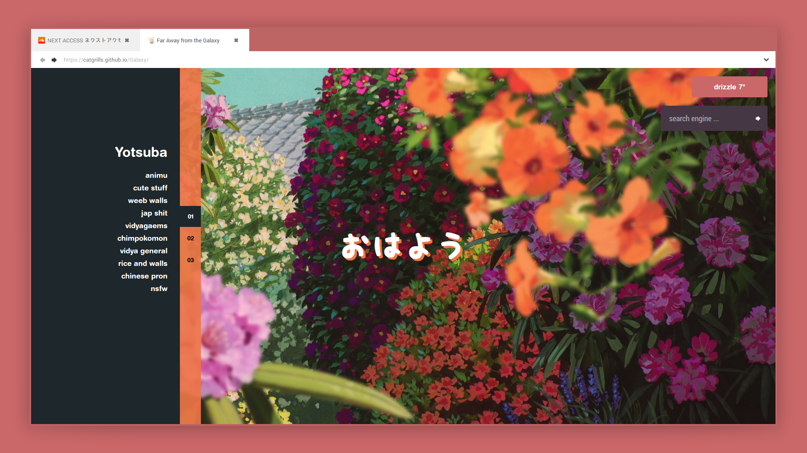

# Galaxy



[Live Demo](https://catgrills.github.io/Galaxy/) of <i>Galaxy</i>.

About
-------------------------------

<i>Galaxy</i> is a startpage featuring a sidebar with three boxes of link, and has a different background depending of the hour.

Startpages are locally hosted, usually, webpage that serves as a homepage for your browser.

Instruction
-------------------------------

<strong>Step 1 : Right click on the <i>.htm</i> file and open it with a browser of your choice</strong>

<strong>Step 2 : Set the startpage as the homepage </strong>

<ol> 
<li> create a github account and fork this repository.</li>
<li> download <a href="https://desktop.github.com/">Github Desktop</a>, go to File/Options and Sign in with your current account.</li>
<li> go to File/Clone repository and select the one you forked (it'll be named <i>Username/Galaxy</i>). </li>
<li> click the <i>Current branch</i> tab and select <i>gh-pages</i>. Then go to Repository/Show in Explorer to customize the startpage. After modifying what you want, return to Github Desktop window and click the button <i>Commit to gh-pages</i> (you'll have to write a title in Summary before).</li>
<li> finally, click the button <i>Push origin</i>. After 10 minutes or less, you'll be able to go to https://username.github.io/Galaxy/.</li>
<li> go to your browser setting and set https://username.github.io/Galaxy/ as your default homepage.</li>
<li> download the add-on <i>New Tab Override</i> (<a href="https://chrome.google.com/webstore/detail/new-tab-override/fjcmlondipcnnpmbcollgifldmajfonf?hl=en-GB">Google Chrome</a> or <a href="https://addons.mozilla.org/en-US/firefox/addon/new-tab-override/">Firefox Mozilla</a>), go to options and select <i>current home page</i></li>
</ol>

<strong>Step 3 : Install the font </strong>

I use several fonts for the startpage.
<ol>
<li> <a href="http://www.ephifonts.com/free-helvetica-font-helvetica-rounded-complete.html">Helvetica Rounded</a>
<li> <a href="https://www.freejapanesefont.com/kf-himaji/">KFhimaji</a></li>
<li> <a href="https://www.fontsquirrel.com/fonts/roboto">Roboto</a></li>
</ol>

Features
-------------------------------

<span><i>Galaxy</i> has four main features.</span>
<ol>
<li>The sidebar has three buttons, each will make appear onclick a list of links (at least ten links per list).</li>
<li>There are three backgrounds that rotate between each other depending of the hour.</li>
<li>In the search bar, by entering some special keys, such as `-y jazz music`, you'll be able to search directly on youtube and not on Google. Another exemple with `-w moe`, it'll search 'moe' on wikipedia.</li>
<li>The weather widget by location (<a href="https://github.com/xDemonessx/homepage">code source</a>).</li>
</ol>

Customizing
-------------------------------

### Weather Location
- go to http://openweathermap.org/, create an account and generate an API key, then you'll have to call it, to do that copy/paste the following link in your URL bar, and don't forget to replace {APIKEY} by your API key : 

```javascript 
api.openweathermap.org/data/2.5/forecast?id=524901&APPID={APIKEY}
```
- open the `js`folder and edit `weather.js`in a text editor, you'll have to modify the following : replace the chain of characters after the `appid=` by your API key, and of course you'll to modify the city and country name after the `weather?q=`(if you live in London you'll have to write `weather?q=London,uk`)

```javascript
var json_url = "http://api.openweathermap.org/data/2.5/weather?q=Paris,fra&appid=a70d956581f575b02ad518684afb6c13";
```

### Search
- open the `js` folder and edit `search.js` in a text editor , you'll have to modify the following code 
``` javascript
case "-u":
query = query.substr(3);
window.location = "https://userstyles.org/styles/browse?search_terms=" 
break;
```
- first, you have to decide of a website (I will take bato.to) and a special key for this said site : I will take -b, thus you'll have the following code

``` javascript
case "-b":
query = query.substr(3);
window.location = "https://userstyles.org/styles/browse?search_terms=" 
break;
```
- after that, you'll need to replace the value of `window.location`, in the example of batoto you'll have to go to the site and search for something, for example if I'm looking for Hinamatsuri (a pretty gud manga, you should read it asap), the link will be `http://bato.to/search?name=Hinamatsuri&name_cond=c`, you'll have to copy the link before 'Hinamatsuri', namely `http://bato.to/search?name=`, and you'll have the following code 

``` javascript
case "-b":
query = query.substr(3);
window.location = "http://bato.to/search?name=" 
break;
```

Report
-------------------------------

If you find some issues or bug while using this startpage, don't hesitate to report it in the comments.
