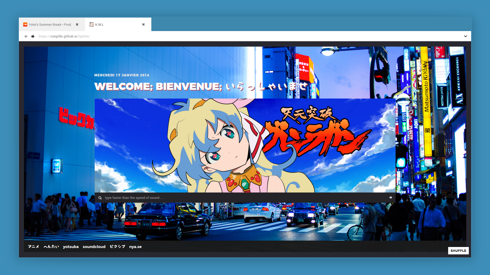

# Spirits



[Live Demo](https://catgrills.github.io/Spirits/) of <i>Spirits</i>.

About
-------------------------------

<i>Spirits</i> is a startpage featuring a three different themes by clicking on the <i>Shuffle</i> button.

Startpages are locally hosted, usually, webpage that serves as a homepage for your browser.

Instruction
-------------------------------

<strong>Step 1 : Right click on the <i>.htm</i> file and open it with a browser of your choice</strong>


<strong>Step 2 : Set the startpage as the homepage </strong>

<ol> 
<li> create a github account and fork this repository.</li>
<li> download <a href="https://desktop.github.com/">Github Desktop</a>, go to File/Options and Sign in with your current account.</li>
<li> go to File/Clone repository and select the one you forked (it'll be named <i>Username/Spirits</i>). </li>
<li> click the <i>Current branch</i> tab and select <i>gh-pages</i>. Then go to Repository/Show in Explorer to customize the startpage. After modifying what you want, return to Github Desktop window and click the button <i>Commit to gh-pages</i> (you'll have to write a title in Summary before).</li>
<li> finally, click the button <i>Push origin</i>. After 10 minutes or less, you'll be able to go to https://username.github.io/Spirits/.</li>
<li> go to your browser setting and set https://username.github.io/Spirits/ as your default homepage.</li>
<li> download the add-on <i>New Tab Override</i> (<a href="https://chrome.google.com/webstore/detail/new-tab-override/fjcmlondipcnnpmbcollgifldmajfonf?hl=en-GB">Google Chrome</a> or <a href="https://addons.mozilla.org/en-US/firefox/addon/new-tab-override/">Firefox Mozilla</a>), go to options and select <i>current home page</i></li>
</ol>

<strong>Step 3 : Install the font </strong>

I use several fonts for the startpage.
<ol>
<li> <a href="https://www.freejapanesefont.com/kf-himaji/">KFhimaji</a></li>
<li> <a href="https://www.fontsquirrel.com/fonts/montserrat">Montserrat</a> </li>
<li> <a href="https://www.fontsquirrel.com/fonts/roboto">Roboto</a></li>
</ol>

Features
-------------------------------

<span><i>Spirits</i> has two main features.</span>
<ol>
<li>the button <i>Shuffle</i> : by clicking it, you'll be able change the banner/background of the startpage.</li>
<li>In the search bar, by entering some special keys, such as `-y jazz music`, you'll be able to search directly on youtube and not on Google. Another exemple with `-w moe`, it'll search 'moe' on wikipedia.</li>
</ol>

Customizing
-------------------------------

### Dates and Months
- open the `.htm` file in a text editor, search for 'var days' (it'll be at the beginning of the document, around line 19), and change the days (instead of 'dimanche' you can write 'sunday' or 'domingo').
- search for 'var months' (under the var days) and change the months (instead of janvier, you can write january or enero). 

``` javascript
/* DAYS AND MONTHS IN ENGLISH */
var days = ['sunday','monday','tuesday','wenesday','thursday.','friday','saturday'];
var months=['january', 'february', 'march', 'april', 'may', 'june', 'july', 'august', 'september', 'october', 'november', 'december'];
```
- if you want to change the structure of the date, you'll have to edit the following code : the `("0" + m.getDate()).slice(-2)` is the dats, the `(months[m.getMonth() ])` is the month and the `m.getFullYear()` is the year,

``` javascript
var dateString = (days[ m.getDay() ])  + " " +  ("0" + m.getDate()).slice(-2) + " " + (months[ m.getMonth() ])   + " " + m.getFullYear()            
```

### Banner and Background
- first of all, like I said previously, change/add the banner in the banner folder and the background in the background folder and renamed them `background[insert a number].jpg` and `banner[insert a number].jpg` (you'll have to change the '[insert a number]' of course.
- open the `js` folder, and edit `banner.js` in a text editor : if you one to add others banners/background, you'll have to copy paste this code, you'll have to change the number of course (if you want a fifth banner/background, replace the `4` by `5` : 

``` javascript
/* ADDING A FOURTH BANNER AND BACKGROUND */
4: {
    image: "banner/banner4.jpg",
    landscape:"background/background04.jpg",

}, 
```
- you'll have to change the value in the following code, for example if you have 6 banner/background, you'll have to copy paste this code 
``` javascript
var randomNumber = Math.floor((Math.random() * 6) + 1);
```

### Search
- open the `js` folder and edit `search.js` in a text editor , you'll have to modify the following code 
``` javascript
case "-u":
query = query.substr(3);
window.location = "https://userstyles.org/styles/browse?search_terms=" 
break;
```
- first, you have to decide of a website (I will take bato.to) and a special key for this said site : I will take -b, thus you'll have the following code

``` javascript
case "-b":
query = query.substr(3);
window.location = "https://userstyles.org/styles/browse?search_terms=" 
break;
```
- after that, you'll need to replace the value of `window.location`, in the example of batoto you'll have to go to the site and search for something, for example if I'm looking for Hinamatsuri (a pretty gud manga, you should read it asap), the link will be `http://bato.to/search?name=Hinamatsuri&name_cond=c`, you'll have to copy the link before 'Hinamatsuri', namely `http://bato.to/search?name=`, and you'll have the following code 

``` javascript
case "-b":
query = query.substr(3);
window.location = "http://bato.to/search?name=" 
break;
```

Disclaimer
-------------------------------

<span>Source of the illustrations used.</span>
<ol>
<li><a href="http://hope1134.deviantart.com/art/Mako-Mankanshoku-Fight-Club-Spec-Two-Star-Uniform-442155412">Mako Vector</a> and <a href="http://www.designdiffusion.com/wp-content/uploads/2014/09/16.jpg">background</a></li>
<li><a href="http://znkhucast.deviantart.com/art/Sucy-Manbavaran-580216558">Suzy Vector</a> and <a href="https://www.flickr.com/photos/megane_wakui/12815388355/">background</a></li>
<li><a href="konachan.com/post/show/32651 ">Nia Vector</a> and <a href="http://burningmonk.deviantart.com/art/Shinjuku-Dusk-317124910">background</a></li>
</ol>

Report
-------------------------------

If you find some issues or bug while using this startpage, don't hesitate to report it in the comments.

